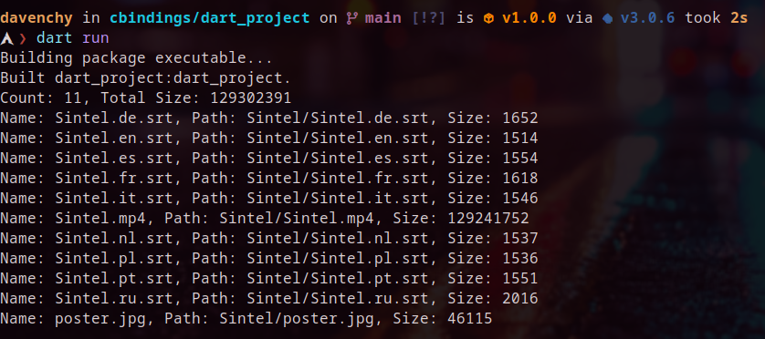

# LibTorrent Dart Bindings Example

## Introduction

Hello there! Welcome to this example project demonstrating how to create LibTorrent bindings for the Dart language. I hope you find it helpful and informative.



## Why??

Everything started from here [https://github.com/dart-lang/native/issues/218](https://github.com/dart-lang/native/issues/218)

## Requirements

Before diving in, make sure you have the following prerequisites installed:

- Ensure libtorrent shared library is installed on your system and recognized by the compiler using the flag `-ltorrent-rasterbar`.
- If you have libtorrent source files in a custom path, update the `wrapper/Makefile` accordingly.
- You'll also need to have the [Dart SDK](https://dart.dev/get-dart) installed.

## Makefile

- The `wrapper/Makefile` contains various useful rules to streamline the development process:

1. **debug**: Builds a test binary with gdb flag enabled for testing/debugging process.
2. **run**: Similar to `debug`, but it also runs the binary after building.
3. **build**: This rule is responsible for building the wrapper library: `libwrapper.so` by default.

## Build the Wrapper Library

- To build the wrapper library, execute the following command:

```sh
make build
```

## Run the Example Project

Once you've built the wrapper library, follow these steps to run the example project:

1. Copy the library file `libwrapper.so` into the Dart project directory.
2. Get dart packages

```sh
dart pub get
```

2. Run the project using the following command:

```sh
dart run
```

## Additional Resources

If you want to dive deeper into LibTorrent, here are some helpful resources:

### LibTorrent Documentation

- [LibTorrent Tutorial](https://www.libtorrent.org/tutorial-ref.html)
- [Settings Pack](https://www.libtorrent.org/reference-Settings.html#settings_pack)
- [Alert Categories](https://www.libtorrent.org/reference-Alerts.html#alert-category-t)
- [Alerts](https://www.libtorrent.org/reference-Alerts.html#overview)
- [Parse Magnet URI](https://www.libtorrent.org/reference-Core.html#parse_magnet_uri())
- [Add Torrent Parameters](https://www.libtorrent.org/reference-Add_Torrent.html#add_torrent_params)
- [Session Handle](https://www.libtorrent.org/reference-Session.html#session_handle)
- [Torrent Handle](https://www.libtorrent.org/reference-Torrent_Handle.html#torrent_handle)
- [Torrent Info](https://www.libtorrent.org/reference-Torrent_Info.html#torrent_info)
- [File Storage](https://www.libtorrent.org/reference-Storage.html)

### Dart FFI

- [C interop using dart:ffi](https://dart.dev/interop/c-interop)
- [dart-lang repo ffi samples](https://github.com/dart-lang/samples/tree/main/ffi)

## Contribution

Feel free to fork this project or create pull requests if you'd like to contribute. **Your feedback and contributions are highly appreciated!**
